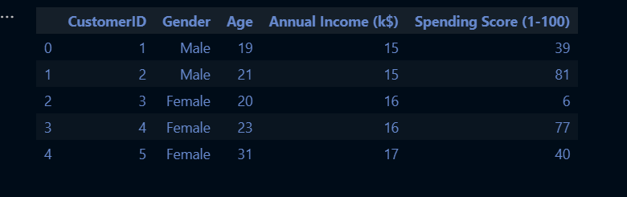
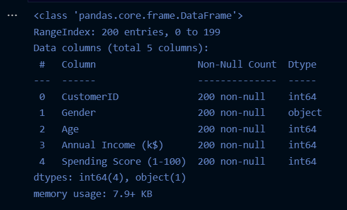
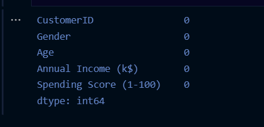
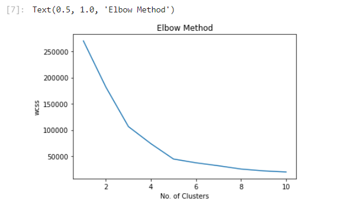
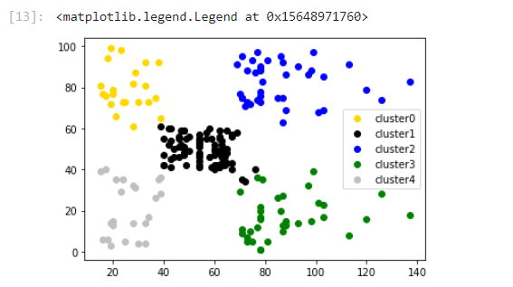
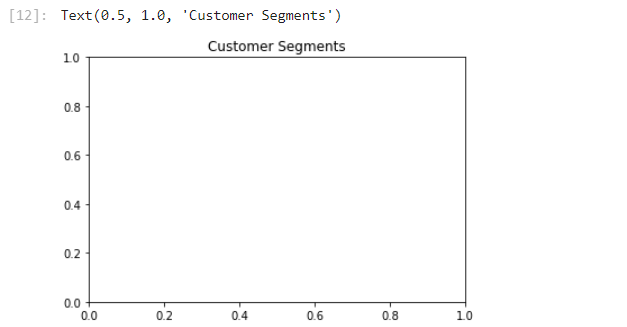

# Implementation-of-K-Means-Clustering-for-Customer-Segmentation...

## AIM:
To write a program to implement the K Means Clustering for Customer Segmentation.

## EQUIPMENTS REQUIRED:
1. Hardware – PCs.
2. Anaconda – Python 3.7 Installation / Moodle-Code Runner.

## ALGORITHM:
### Step 1:
Import the necessary python packages using import statements. 

### Step 2:
Read the given csv file using read_csv() method and print the number of contents to be displayed using df.head(). 

### Step 3:
Import KMeans and use for loop to cluster the data.

### Step 4:
Predict the cluster and plot data graphs.

### Step 5:
Print all the outputs.

### Step 6:
End the Program.

## PROGRAM:
```
/*
Program to implement the K Means Clustering for Customer Segmentation.
Developed by: Anto Richard.S
RegisterNumber: 212221240005 
*/

import pandas as pd
import matplotlib.pyplot as plt
data = pd.read_csv("Mall_Customers.csv")

data.head()

data.info()

data.isnull().sum()

from sklearn.cluster import KMeans
wcss = []

for i in range(1,11):
    kmeans = KMeans(n_clusters = i,init = "k-means++")
    kmeans.fit(data.iloc[:,3:])
    wcss.append(kmeans.inertia_)

plt.plot(range(1,11),wcss)
plt.xlabel("No. of Clusters")
plt.ylabel("wcss")
plt.title("Elbow Method")

km = KMeans(n_clusters = 5)
km.fit(data.iloc[:,3:])

y_pred = km.predict(data.iloc[:,3:])
data["cluster"] = y_pred

df0 = data[data["cluster"]==0]
df1 = data[data["cluster"]==1]
df2 = data[data["cluster"]==2]
df3 = data[data["cluster"]==3]
df4 = data[data["cluster"]==4]

plt.scatter(df0["Annual Income (k$)"],df0["Spending Score (1-100)"],c="gold",label="cluster0")
plt.scatter(df1["Annual Income (k$)"],df1["Spending Score (1-100)"],c="black",label="cluster1")
plt.scatter(df2["Annual Income (k$)"],df2["Spending Score (1-100)"],c="blue",label="cluster2")
plt.scatter(df3["Annual Income (k$)"],df3["Spending Score (1-100)"],c="orange",label="cluster3")
plt.scatter(df4["Annual Income (k$)"],df4["Spending Score (1-100)"],c="silver",label="cluster4")
plt.legend()

plt.title("Customer Segments")  

```

## OUTPUT:

### DATA.HEAD():


### DATA.INFO():


### DATA.ISNULL().SUM():


### PLT-ELBOW METHOD:


### KM.FIT(DATA.ILOC):


### PLT.LEGEND():


### PLT-CUSTOMER SEGMENTS:


## RESULT:
Thus the program to implement the K Means Clustering for Customer Segmentation is written and verified using python programming.
